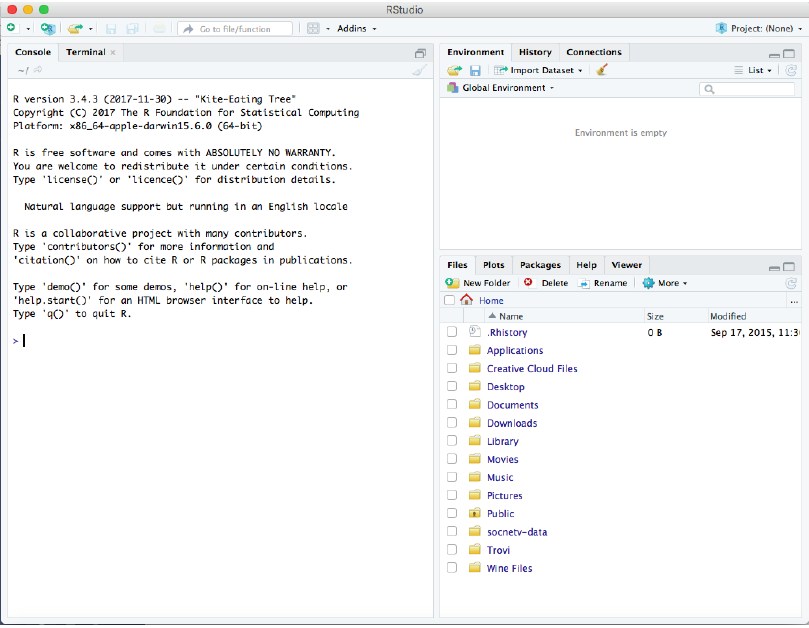

# Module 01

## Module 01 portfolio check

* Installation check
    + Completion status:
    + Comments:
* Portfolio repo setup
    + Completion status: 
    + Comments:
* RMarkdown Pretty html Challenge
    + Completion status:
    + Comments:
* Evidence worksheet_01
    + Completion status:
    + Comments:
* Evidence worksheet_02
    + Completion status:
    + Comments:
* Evidence worksheet_03
    + Completion status:
    + Comments:
* Problem Set_01
    + Completion status:
    + Comments:
* Problem Set_02
    + Completion status:
    + Comments:
* Writing assessment_01
    + Completion status:
    + Comments:
* Additional Readings
    + Completion status:
    + Comments  
    
## Data science Friday  

### Installation check




### Portfolio repo setup
Code you used to create, initialize, and push a portfolio repo to GitHub:

git init
git add .
git commit -m "First commit"
git remote add origin https://remote_repository_URL
git remote -v
git push -u origin master

To push my portfolio repo to GitHub for updates:

git add .
git commit -m "First commit"
git push

### RMarkdown pretty html challenge
---
title: "Pretty_html"
author: "Alison Fong 33399149"
date: "version `r format(Sys.time(), '%B %d, %Y')`"
output:
  html_document:
    toc: yes
---
#R Markdown PDF Challenge
The following assignment is an exercise for the reproduction of this .html document using the RStudio and RMarkdown tools we’ve shown you in  class. Hopefully by the end of this, you won’t feel at all the way this poor PhD student does. We’re here to help, and when it comes to R, the  internet is a really valuable resource. This open-source program has all kinds of tutorials online.


http://phdcomics.com/ Comic posted 1-17-2018


##Challenge Goals
The goal of this R Markdown html challenge is to give you an opportunity to play with a bunch of different RMarkdown formatting. Consider it a  chance to flex your RMarkdown muscles. Your goal is to write your own RMarkdown that rebuilds this html document as close to the original as  possible. So, yes, this means you get to copy my irreverant tone exactly in your own Markdowns. It’s a little window into my psyche. Enjoy =)

**hint: go to the [PhD Comics website](http://phdcomics.com/) to see if you can find the image above**  
*If you can’t find that exact image, just find a comparable image from the PhD Comics website and include it in your markdown*


###Here's a header!
Let’s be honest, this header is a little arbitrary. But show me that you can reproduce headers with different levels please. This is a level 3 header,  for your reference (you can most easily tell this from the table of contents).


####Another header, now with maths
Perhaps you’re already really confused by the whole markdown thing. Maybe you’re so confused that you’ve forgotton how to add. Never fear! ~~A  calculator~~ R is here:

```{r title, message=TRUE, warning=FALSE}
1231521+12341556280987
```

###Table Time
Or maybe, after you’ve added those numbers, you feel like it’s about time for a table!  
I’m going to leave all the guts of the coding here so you can see how libraries (R packages) are loaded into R (more on that later). It’s not terribly  pretty, but it hints at how R works and how you will use it in the future. The summary function used below is a nice data exploration function that  you may use in the ^future^.

```{r} 
library(knitr)
kable(summary(cars),caption="I made this table with kable in the knitr package library")
```

And now you’ve almost finished your first RMarkdown! Feeling excited? We are! In fact, we’re so excited that maybe we need a big finale eh?  Here’s ours! Include a fun gif of your choice!


###Plotting Data in R
####Exercise 1
```{r geompoint}

library(tidyverse)
library(phyloseq)
library(dplyr)

metadata_new = read.table(file="Saanich.metadata.txt", header=TRUE, row.names=1, sep="\t", na.strings="NAN")
OTU_new = read.table(file="Saanich.OTU.txt", header=TRUE, row.names=1, sep="\t", na.strings="NAN")
load("phyloseq_object.RData")

ggplot(metadata_new, aes(x=PO4_uM, y=Depth_m)) +
  geom_point(shape=17, color="purple")

```

####Exercise 2
```{r tempt_mutate}

metadata_new %>% 
  select(matches("Temp"))
metadata_new %>% 
  mutate(Temperature_F = Temperature_C*1.8+32) %>%
  ggplot() + geom_point(aes(y=Depth_m, x=Temperature_F))

```

####Exercise 3
```{r title_labels}

physeq_percent = transform_sample_counts(physeq, function(x) 100 * x/sum(x))
plot_bar(physeq_percent, fill="Genus") + 
  geom_bar(aes(fill=Genus), stat="identity") + ggtitle("Genus Percentages") + xlab("Sample Depth") + ylab("Percent Relative Abundance")

```

####Exercise 4
```{r ggplot}

table_5_1= metadata_new %>% select(Depth_m, O2_uM, PO4_uM, SiO2_uM, NO3_uM, NH4_uM, NO2_uM)
table_5_2= table_5_1 %>% gather (Nutrients, Concentration, O2_uM, PO4_uM, SiO2_uM, NO3_uM, NH4_uM, NO2_uM)
ggplot(table_5_2, aes(x=Depth_m, y=Concentration)) +
  geom_point() + geom_line()+ facet_wrap(~Nutrients, scales="free_y") +
  theme(legend.position="none")

```

## Origins and Earth Systems
### Evidence worksheet 01 
[Whitman *et al* 1998](https://www.ncbi.nlm.nih.gov/pmc/articles/PMC33863/)

#### Learning objectives
Describe the numerical abundance of microbial life in relation to ecology and biogeochemistry of Earth systems. 

#### General questions
* What were the main questions being asked?  
What is the number of prokaryotes and the total amount of their cellular carbon on Earth?

* What were the primary methodological approaches used? 
Aquatic Environments: estimates of cell density, volume, and carbon
Soil: estimates from detailed direct counts from representative soils, estimates from other papers/unpublished field studies of EA Paul for cultivated soils 
Subsurface: calculation of arithmetic averages to create a depth profile, extrapolation from formula of published papers
2 other approaches:
(1) Assuming average porosity of the terrestrial subsurface is 3%
(2) Estimation from groundwater data
Other Habitats: 
For animals - using # of prokaryotes in each individual animal and the population size of the animal
For leaves - leaf area estimated from leaf area index; assuming a dense population 
For air - estimates from references
To estimate carbon content in prokaryotes: estimations using cell numbers; using average dry weight of cells; average cellular carbon

* Summarize the main results or findings.
Number of prokaryotes is estimated to be 4-6 x 10^30 cells
Prokaryotes’ cellular carbon on Earth is estimated to be 350-550 Pg of C
Total amount of prokaryotic carbon = 60-100% of the estimated total carbon in plants, so inclusion of prokaryotic carbon in global models will almost double estimates of the amount of carbon stored in living organisms
Earth’s prokaryotes contain 85-130 Pg of N and 9-14 Pg of P
Number of prokaryotes in:
(1) Open ocean: 1.2 x 10^29 cells
(2) Soil: 2.6 x 10^29 cells
(3) Oceanic subsurfaces: 3.5 x 10^30 cells
(4) Terrestrial subsurfaces: 0.25-2.5 x 10^30 cells
Average turnover times of heterotrophic prokaryotes in:
(1) Upper 200 m of open ocean: 6-25 days
(2) Ocean below 200 m: 0.8 year
(3) Soil: 2.5 years
(4) Subsurface: 1-2 x 10^3 years
Cellular production rate for all prokaryotes on Earth is estimated to be 1.7 x 10^30 cells per year; highest in open ocean

* Do new questions arise from the results?  
How do carbon content in prokaryotes interact with carbon content from the environment?
How is carbon from relatively inaccessible sources cycled through the carbon cycle?

* Were there any specific challenges or advantages in understanding the paper (*e.g.* did the authors provide sufficient background information to understand experimental logic, were methods explained adequately, were any specific assumptions made, were conclusions justified based on the evidence, were the figures or tables useful and easy to understand)?
No supplemental figures were included; math was not shown
Tables were easy to understand, but I wasn’t sure how or where the got the numbers from
A lot of the methods were calculations based on assumptions (see methods question above)
Enough evidence were supplemented to reach the conclusion; it was more of a question of whether the evidence they based it on were valid/accurate —> papers were referenced, but we might have to go through each individual referenced paper to convince ourselves their values were accurate and reliable 
I was a little confused on the schematics of how different habitats/depths of the earth are linked together; it may be helpful to provide a depth diagram or a habitat diagram to show exactly which areas of the earth we are talking about/calculating for 


### Problem set 01
#### Learning objectives: 
Describe the numerical abundance of microbial life in relation to the ecology and biogeochemistry of Earth systems.

#### Specific questions:
* What are the primary prokaryotic habitats on Earth and how do they vary with respect to their capacity to support life? Provide a breakdown of total cell abundance for each primary habitat from the tables provided in the text.
From Table 5: 
Aquatic habitats - 1.2 x 10^29 cells (From Table 1, large population ≠ cell density)
Oceanic subsurface - 3.55 x 10^30 cells
Soil - 2.6 x 10^29 cells
Terrestrial subsurface - 25-250 x 10^28 cells

* What is the estimated prokaryotic cell abundance in the upper 200 m of the ocean and what fraction of this biomass is represented by marine cyanobacterium including Prochlorococcus? What is the significance of this ratio with respect to carbon cycling in the ocean and the atmospheric composition of the Earth?
Estimated prokaryotic cell abundance in upper 200 m = 3.60 x 10^28
Upper 200 m - cellular density ~ 5 x 10^5 cells/ml
Proclorococcus - celluar density ~ 4 x 10^4 cells/ml
(4x10^4)/(5x10^5) x 100 = 8%
Prochlorococcus = there must be high turnover of Prochlorococcus in order to support the carbon that’s cycling in the ocean b/c only 8% of prokaryotic cells in the upper 200 m of the ocean are Prochlorococcus; Prochlorococcus is the main source of carbon in the ocean

* What is the difference between an autotroph, heterotroph, and a lithotroph based on information provided in the text?  
Autotroph - uses inorganic carbon as carbon source (incorporated into their own cells, not just used as part of metabolism; Ex. CO2); self-nourishing; fix inorganic carbon (CO2) into biomass
Heterotroph - uses organic carbon as carbon source (incorporated into their own cells, not just used as part of metabolism); assimilate organic carbon
Lithotroph - uses inorganic chemicals (i.e. minerals, irons) as e- source; use inorganic substrates

* Based on information provided in the text and your knowledge of geography what is the deepest habitat capable of supporting prokaryotic life? What is the primary limiting factor at this depth?  
Deep habitats supporting life: 
Subsurface —> terrestrial = 4 km; marine = deepest subsurface is 9-10 km from sea level
Primary limiting factor = temperature (avg temperature at this depth is 125˚C, which is the close to the upper temperature limit for prokaryotic life); ∆˚C ~ 22˚C/km

* Based on information provided in the text your knowledge of geography what is the highest habitat capable of supporting prokaryotic life? What is the primary limiting factor at this height?  
Atmospheric —> 57-77 km above sea level (realistic boundary = 20 km above sea level)
Primary limiting factor = nutrients and temperature; very humid with UV ionization in upper atmosphere

* Based on estimates of prokaryotic habitat limitation, what is the vertical distance of the Earth’s biosphere measured in km?
Assuming top of Mt. Everest as the top boundary and 4km below subsurface as the lower boundary = 8.8 km + 10 km + 4km =~ 23 km

* How was annual cellular production of prokaryotes described in Table 7 column four determined? (Provide an example of the calculation)  
Population size (divided by) turnover time days/(365 days/yr) = cells/year 
(3.6x10^28)/(16/365) = 8.2 x 10^29
Viruses carry accessory metabolic genes —> protein encoding genes that play a role in cytometabolism (not just there for viral replication, but can influence metabolic network within cell and essentially reprogram the cell) —> cells are information circuit boards that can actually be reprogrammed by viruses!

* What is the relationship between carbon content, carbon assimilation efficiency and turnover rates in the upper 200m of the ocean? Why does this vary with depth in the ocean and between terrestrial and marine habitats?  
Carbon assimilation efficiency is assumed to be 0.2 (or 20%) in the paper (held constant)
—> amount of “net productivity” necessary to support turnover of prokaryotes in the upper 200 m of the ocean is 4 times their carbon content or 0.7-2.9 Pg of C
—> assuming 85% of net productivity is consumed in the upper 200 m and assuming all this carbon is used by prokaryotes, average turnover rate cannot exceed 15-60 yr^-1
To calculate, we need to know total # of cells and the total # of C/cell
Total C/cell = 20 fg C/cell —> average = 10 fg C/cell = 10^-30 Pg/cell
Total # of cells = 3.6 x 10^28 cells
3.6x10^28 cells x 10^-30 Pg/cell = 0.72 Pg C in marine heterotrophs
Used a multiplier of 4 in the paper —> 4 x 0.72 = 2.88 Pg C/year (that’s the turnover rate of C)
51 Pg C/year —> 85% is consumed, thats ~ 43 Pg C/year
(43 Pg C/year)/(2.88 Pg C/year) = 14.9 or 1 turnover every 24.5 days

* How were the frequency numbers for four simultaneous mutations in shared genes determined for marine heterotrophs and marine autotrophs given an average mutation rate of 4 x 10^-7^ per DNA replication? (Provide an example of the calculation with units. Hint: cell and generation cancel out)
4x10^-7 mutations/generation
Take it to the power of 4 (for 4 simultaneous mutations) —> 2.56 x 10^-26 mutations/generation
We need to know the turnover rate (how quickly the cells generate themselves; how many generations per year?) —> 3.6x10^28 cells; 365 days/16 days (this is the turnover rate) = 22.8 turnovers/year
(3.6x10^28 cels/year) x 22.8 = 8.2x10^29 cells/year in ocean
(8.2x10^29 cells/year) x (2.56x10^-26 mutations/generation) = 2.1x10^4 mutations/year = 0.4 hours/mutation
4 mutations simultaneously is rare , but this calculation shows that this is still occurring frequently (point mutations) — whole other mobile aspect to microbial genome that is drastically more rapid than even this background mutation rate; when you have large pop’l sizes, almost anything is possible

* Given the large population size and high mutation rate of prokaryotic cells, what are the implications with respect to genetic diversity and adaptive potential? Are point mutations the only way in which microbial genomes diversify and adapt?  


* What relationships can be inferred between prokaryotic abundance, diversity, and metabolic potential based on the information provided in the text? 


### Evidence Worksheet_02 
#### Learning objectives: 
Comment on the emergence of microbial life and the evolution of Earth systems
    
    
* Indicate the key events in the evolution of Earth systems at each approximate moment in the time series. If times need to be adjusted or added to the timeline to fully account for the development of Earth systems, please do so. 

    + 4.6 billion years ago  
    
    + 4.2 billion years ago  
    
    + 3.8 billion years ago  
    
    + 3.75 billion years ago  
    
    + 3.5 billion years ago  
    
    + 3.0 billion years ago  
    
    + 2.7 billion years ago  
    
    + 2.2 billion years ago  
    
    + 2.1 billion years ago
    
    + 1.3 billion years ago
    
    + 550,000 years ago
    
    + 200,000 years ago


* Describe the dominant physical and chemical characteristics of Earth systems at the following waypoints:  

    + Hadean  
    
    + Archean  
    
    + Precambrian  
    
    + Proterozoic  
    
    + Phanerozoic  
    

### Problem set_02 
#### Learning objectives: 
Discuss the role of microbial diversity and formation of coupled metabolism in driving global biogeochemical cycles.

#### Specific Questions:
* What are the primary geophysical and biogeochemical processes that create and sustain conditions for life on Earth? How do abiotic versus biotic processes vary with respect to matter and energy transformation and how are they interconnected?  

* Why is Earth’s redox state considered an emergent property?
  

* How do reversible electron transfer reactions give rise to element and nutrient cycles at different ecological scales? What strategies do microbes use to overcome thermodynamic barriers to reversible electron flow?  

* Using information provided in the text, describe how the nitrogen cycle partitions between different redox “niches” and microbial groups. Is there a relationship between the nitrogen cycle and climate change?   

* What is the relationship between microbial diversity and metabolic diversity and how does this relate to the discovery of new protein families from microbial community genomes?  

* On what basis do the authors consider microbes the guardians of metabolism?  


### Module 01 references


Whitman WB, Coleman DC, and Wiebe WJ. 1998. Prokaryotes: The unseen majority. Proc Natl Acad Sci USA. 95(12):6578–6583.  [PMC33863](https://www.ncbi.nlm.nih.gov/pmc/articles/PMC33863/)